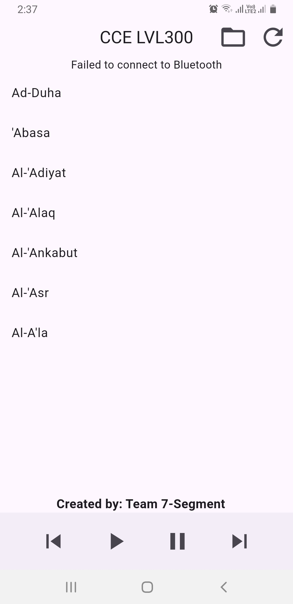

# Bluetooth Media Player - Gesture-Controlled Music App

## Overview
The Bluetooth Media Player app, created by Team 7-Segment, is designed to connect and interact with Bluetooth devices using gesture controls. This app is built using Flutter and provides an intuitive user experience for controlling music playback via Bluetooth.

## Features
- **Gesture Controls**: Play, pause, skip, and rewind music tracks using gestures.
- **Bluetooth Connectivity**: Connect to Bluetooth devices for music playback.
- **File Picker**: Select multiple audio files from your device.

## Screenshots
### Main Screen

*Main screen with connection status and options.*

### Song List

*List of songs available after Bluetooth connection.*

## Getting Started
1. **Clone the Repository**:
   ```bash
   git clone https://github.com/your-username/bluetooth_gesture.git
